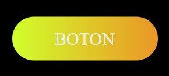

# Boton-de-efecto-de-colores-RGB
un botón con animacion de colores que se alternar cuando el cursor esta sobre el 

  
    
  
    
  

## ¿Cuál es el fin de este proyecto?
Este proyecto se creó con fines de aprendizaje usando HTML y CSS.

## ¿Puedo Probarlo en Linea? 
Si, Puedes probarlo en linea haciendo click [aqui](https://carlosorellana00.github.io/Boton-de-efecto-de-colores-RGB/)

## ¿Como puedo ver como funciona?
Facil, solo debes de colocar el cursor sobre el boton y veras el efecto actuar

## Imagenes de Ejemplo:

  
  
  

  

## Referencias y Agradecimientos a: 
 - [Autor: Techie Coder](https://www.youtube.com/c/TechieCoder)
 - [Video Original ->Glowing Gradient Button Animation Effects on Hover Using Html and CSS - CSS Animation Effects](https://www.youtube.com/watch?v=OyKXb-42-SQ)
